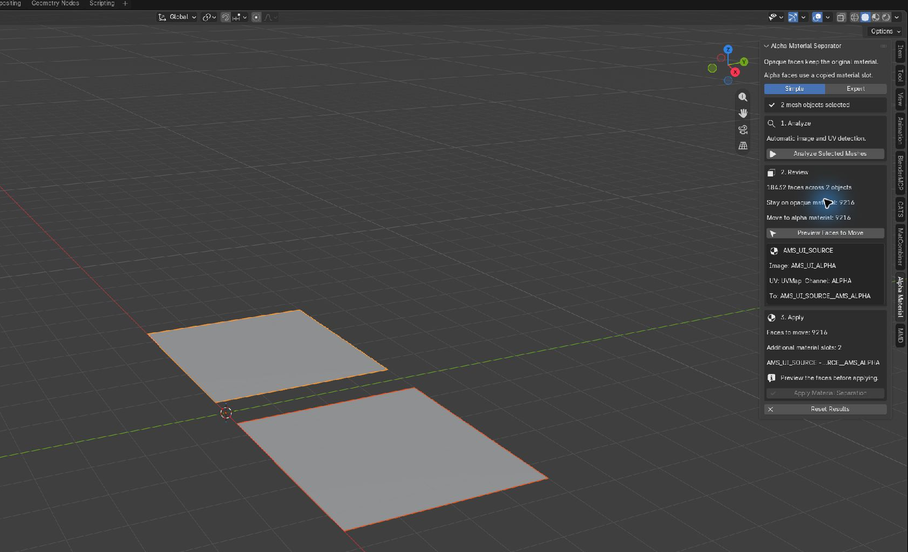
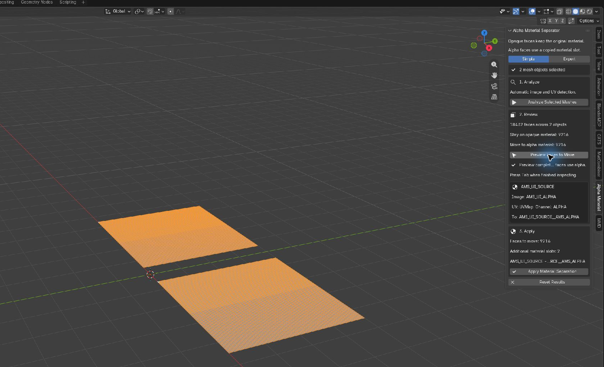
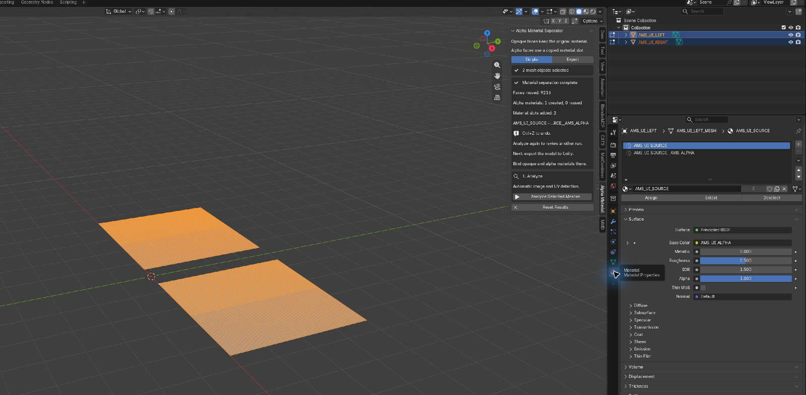

# Blender Alpha Material Separator

## What it does

Blender Alpha Material Separator finds mesh faces that use alpha-affected image
pixels and puts those faces in a second material slot. Opaque faces stay on the
original material. The result is one object with opaque and alpha material
sections. The extension does not cut geometry, split the object, or configure
Unity or VRChat shaders automatically.

Version 0.1.0 targets Blender 5.2 LTS and is still undergoing release
validation.


## Requirements and installation

1. Download or build `alpha_material_separator-0.1.0.zip`. Do not unzip it.
2. In Blender 5.2, open **Edit → Preferences → Get Extensions**.
3. Open the menu at the upper right, choose **Install from Disk**, and select the
   ZIP.
4. Confirm that **Blender Alpha Material Separator** is enabled.
5. Return to a 3D View, press `N`, and open the **Alpha Material** tab.

Save your `.blend` before processing an important model. Assignment supports
Blender Undo, but a saved file is still the safest starting point.

## 60-second Simple workflow

1. Select the mesh object or objects you want to process. You may start in
   Object Mode or Mesh Edit Mode; **Analyze Selected Meshes** automatically
   switches to Object Mode before reading the base meshes.
2. Leave the interface on **Simple** and click **Analyze Selected Meshes**.
3. Read the face counts. **Material Details** is collapsed after every successful analysis.
   Open it only for the per-material image, UV, destination, or manual-source
   action. If the notice says that materials may need an alpha source, choose
   **Open Material Details** and review them. Automatic detection is the normal
   path; no settings are required for supported materials.
4. Preview is recommended but optional. Click **Preview Faces to Move** when
   you want Blender to enter multi-object Edit Mode and select the exact faces
   that would use alpha. Press `Tab` when you finish inspecting them. Tabbing
   out, changing face selection, or changing the active object does not require
   another analysis when the mesh, UVs, materials, images, and settings are
   unchanged.
5. Click **Apply Material Separation**. Apply without Preview always asks for confirmation.
   A clean plan that exactly matches a completed Preview applies immediately.
   Mixed or uncertain faces, unchanged/skipped material groups, suppressed
   evidence, or conflicts also produce a warning dialog. It reports only
   aggregate assignment outcomes. Object, material, image, UV, and destination
   details remain under **Review → Material Details**.
6. Check the object's material slots. The original material remains the opaque
   candidate and `<source>__AMS_ALPHA` is the alpha candidate.







## What the results mean

| Result shown in Blender | Meaning | Default action |
| --- | --- | --- |
| **Stay on opaque material** | No covered image pixel is below the alpha threshold. | Keep the face on the source material. |
| **Move to alpha material** | Every covered image pixel is alpha-affected. | Move the face to `__AMS_ALPHA`. |
| **Mixed—must use alpha without cutting geometry** | One polygon covers both opaque and alpha-affected pixels. | Move it to alpha. Making only part opaque would require topology cutting, which 0.1 does not do. |
| **Below significance—needs review** | Alpha evidence exists but is below an Expert minimum. | Skip that entire source-material group by default. |
| **Could not analyze** | The extension could not prove a face result or resolve that material's alpha source. | If the material source was resolved, uncertain faces move to alpha by the Simple default. A material with no traceable alpha source stays completely unchanged. |

The Apply preflight lists faces to move, source and destination materials,
additional slots, uncertain faces moving to alpha, materials deliberately left
unchanged, and anything blocked for safety. Each material is planned
independently, so an unrelated material with no traceable alpha source does not
prevent a supported material from being separated.

## Simple and Expert interfaces

**Simple** is the recommended interface. It keeps the safe defaults and shows
only Analyze, Review, and Apply.

**Expert** adds analysis thresholds and limits, per-material manual alpha
sources, alternate classification inspection, exception policies, and technical
diagnostics.

For face-local uncertainty, Expert mode can keep those faces on the source or
skip that resolved material group instead of using the Simple alpha fallback.

The defaults normally stay unchanged: threshold `0.999`, minimum affected
pixels `1`, minimum fraction `0`, margin `0`, automatic addressing, mixed faces
to alpha, face-local uncertainty to alpha, and conservative handling of
below-significance evidence or unresolved material sources.
Switching Simple/Expert does not invalidate a result; changing an analysis
setting or manual source does.

## Manual alpha sources

Automatic detection first honors a supported Image Texture Alpha connection.
When Principled Alpha is genuinely unlinked, it can instead read the stored A
channel of the Image Texture feeding active Principled Base Color, directly or
through simple reroutes. This works independently of Blender transparency
settings, and unrelated normal, roughness, emission, or disconnected image
nodes do not defeat it. If a material card says **No clear alpha image was
found**, click **Set Manual Alpha Source**. The interface switches to Expert
mode and creates an override for only that material. Other materials remain
automatic.

Each manual record has:

- **Target Material**: the only material affected by the record.
- **Alpha Image**: optional. When blank, the automatically resolved image is
  retained.
- **Image Channel**: Alpha, Red, Green, Blue, or Luminance. Non-alpha channels
  are available only after an explicit image is selected.
- **UV Map**: optional exact name. Blank uses the resolved active render UV.
- **Addressing**: Automatic, Repeat, Extend, Clip, or Mirror.

UV coordinates may be below 0 or above 1 on either axis. They are analyzed
against the pixels selected by the material's Repeat, Extend, Clip, or Mirror
addressing mode. Only malformed or zero-area UV faces are rejected for their UV
data; being outside the base tile is not an error.

Typical recipes:

- **Separate alpha-mask texture:** select that image and its Alpha channel.
- **Mask packed into RGB:** select the packed image and the correct Red, Green,
  or Blue channel.
- **Different raw UV layer:** leave the image blank if automatic detection is
  correct, then enter the intended UV map.
- **Mapped, multiplied, grouped, or procedural alpha:** bake the final intended
  mask to an image, then select the baked image/channel/UV. The extension does
  not guess or evaluate arbitrary shader math.

Every override participates in stale-result detection. Analyze again after
editing the chosen image, supported Alpha/Base Color path, UV authority,
threshold, or override. An edit elsewhere in the source shader keeps the face
classification but invalidates the reviewed assignment plan.
Assignment-only plan changes require confirmation, not another analysis.
Preview the revised plan if you want to inspect its faces before applying.

A material without an automatic or manual alpha source is left exactly as it
was. Set a manual source only when that material also needs to be split; it does
not have to be resolved merely to let another material proceed.

## What each step changes

- **Analyze** switches from Mesh Edit Mode to Object Mode when necessary, then
  reads selected base meshes, materials, UVs, and image pixels. It makes no
  persistent mesh or material change.
- **Preview** changes face selection and normally enters multi-object Edit Mode.
  It does not change topology or material assignments.
- **Apply** creates or reuses local `<source>__AMS_ALPHA` materials, appends
  planned material slots, and changes only the intended polygons' material
  indices. Without a matching Preview, it asks for confirmation first.
- Source materials, shaders, images, armatures, weights, shape keys, UVs,
  normals, attributes, modifiers, parenting, and unselected objects are not
  rewritten.

## Undo, rerun, and stale results

Press `Ctrl+Z` to undo assignment and `Ctrl+Shift+Z` to redo it. Assignment
clears the active report, so analyze again before another preview or apply.
Repeated runs are idempotent: a valid existing alpha material and slot are
reused, and the UI reports **Already separated — no additional changes**.

Blender may report mesh updates when you only enter or leave Edit Mode or alter
face selection. The extension rechecks the relevant structural inputs and keeps
the same completed report and preview when they are equal. It requests another
analysis only after a confirmed classification-input change. An unrelated
source-shader edit does not rerasterize faces, but it invalidates the exact-plan
Preview. Apply then asks for confirmation unless you Preview the revised plan.
Apply always performs a final synchronous check before mutating material
assignments.

Shared multi-user meshes, linked/read-only data, and restricted library
overrides are skipped instead of being made local or single-user automatically.

## Unity and VRChat handoff

After FBX export, the source Blender material is the opaque candidate and
`__AMS_ALPHA` is the cutout/transparent candidate. Blender material duplication
does **not** select Unity or VRChat shaders.

1. Import the processed FBX and confirm both material sections/submeshes exist.
2. Bind the source section to an opaque Unity material.
3. Bind the `__AMS_ALPHA` section to a cutout/alpha-clip or transparent material.
4. If the project already has correctly configured Unity materials, reassign
   those existing materials instead of recreating shader settings in Blender.
5. Verify textures, cutoff, filtering, mipmaps, compression, animation, and
   blendshapes in the target project.

This can reduce transparent overdraw but usually adds a material section and
draw call. Raw Blender image alpha cannot exactly reproduce Unity filtering,
mipmaps, compression, clipping, or shader-specific behavior. See the detailed
[Unity and VRChat workflow](docs/unity-vrchat-workflow.md).

## Troubleshooting

| Message or symptom | What to do |
| --- | --- |
| **No mesh objects selected** | Select one or more Mesh objects in Object Mode or Mesh Edit Mode. |
| **No clear alpha image was found** | Use **Set Manual Alpha Source** for that material. |
| **Alpha uses unsupported shader processing** | Select the intended image/channel manually, including the Base Color image's Alpha channel when appropriate, or bake a combined/procedural result. |
| **No active render UV map** | Set an active render UV or enter the exact UV name in Expert mode. |
| **Texture coordinates are not a supported UV path** | Choose a raw UV map or bake the mapped result. |
| **Image type/projection is not supported** | Use a static flat-UV image or bake the intended mask. |
| **Mesh data is shared/read-only/linked** | Make a deliberate editable copy. The extension never does this automatically. |
| **Below significance—needs review** | Inspect the faces and deliberately choose an Expert policy if the default skip is not appropriate. |
| **Uncertain faces will use alpha** | The alpha source is valid, but some faces have collapsed UVs or exceeded a deterministic coverage budget. Preview them; the Simple default keeps possible transparency by routing them to alpha. |
| **Left unchanged — no alpha source selected** | This material does not block supported materials. Use **Set Manual Alpha Source** only if this material also needs separation. |
| **Inputs Changed — Analyze Again** | A classification input—such as the chosen image/path, UV, settings, slot binding, or mesh—changed after analysis. Reanalyze. |
| Apply asks for confirmation again after a shader edit | The face classification is still valid, so the edit does not require another analysis. Preview the revised material-copy plan if you want to inspect it. |
| The message appears after pressing `Tab` without editing inputs | This is a defect; mode and selection changes alone should be revalidated and reused. Include the Technical Details state in a bug report. |
| **Source or alpha material changed** | Preserve the edited material and explicitly choose reuse or a new variant in Expert mode. |
| Everything stays opaque | Confirm the intended image/channel and that affected pixels are below `0.999`. |
| Analysis is slow | Full 4K/8K image verification is intentionally conservative. Wait, press Esc, or use **Cancel Analysis** safely. |

Technical codes remain available under Expert → **Technical Details** for bug
reports and integrations.

## Supported and unsupported material setups

Supported automatic paths include direct Image Texture Alpha to the active
Principled Alpha input, simple reroutes, and one Image Texture Color authority
feeding active Principled Base Color while Alpha is unlinked. The latter reads
that image's decoded stored A channel even when the material contains ancillary
images. Its technical source code, `UNIQUE_BASE_COLOR_IMAGE_ALPHA`, means a
unique Base Color authority—not a globally single-image material. Direct UV Map
nodes and Texture Coordinate UV are also supported. Explicit Alpha sources and
manual per-material image/channel/UV/addressing records take precedence.
Connected unsupported Alpha processing and complex Mix, Math, Mapping, group,
or procedural Base Color paths are reported rather than silently guessed; use
a manual or baked source for those cases.

Version 0.1 does not cut contours, subdivide geometry, separate objects, rewrite
shaders, automate Unity, integrate CATS automatically, analyze evaluated
modifier topology, or install runtime dependencies. See the exact
[material-support matrix](docs/material-support.md).

## Glossary

- **Alpha:** image data used for cutout or transparent rendering.
- **UV map:** coordinates that place mesh faces over an image.
- **Pixel/texel:** an image cell covered by a UV-mapped face.
- **Source material:** the existing Blender material retained for opaque faces.
- **Alpha material:** the local `__AMS_ALPHA` copy used by affected faces.
- **Material slot/submesh:** a material section on one mesh; it does not mean a
  separate Blender object.

## Developer documentation

The extension package lives under `addon/`. Generated ZIPs belong in
`.packaged-releases/`; private references belong in `.local-references/`. Both
are ignored by Git.

```powershell
$Blender52 = 'C:\Program Files\Blender Foundation\Blender 5.2\blender.exe'

python -m unittest discover -s tests/unit -t . -v
& $Blender52 --factory-startup --background --python-exit-code 1 --python tests/blender/run_all.py
& $Blender52 --factory-startup --command extension validate addon
.\scripts\build_extension.ps1 -Blender $Blender52
```

Further references: [testing](docs/testing.md),
[performance](docs/performance.md), and
[integration API](docs/integration-api.md).

## License

Blender Alpha Material Separator is licensed under `GPL-3.0-or-later`. The
canonical GNU GPL version 3 text is preserved in [LICENSE](LICENSE).
