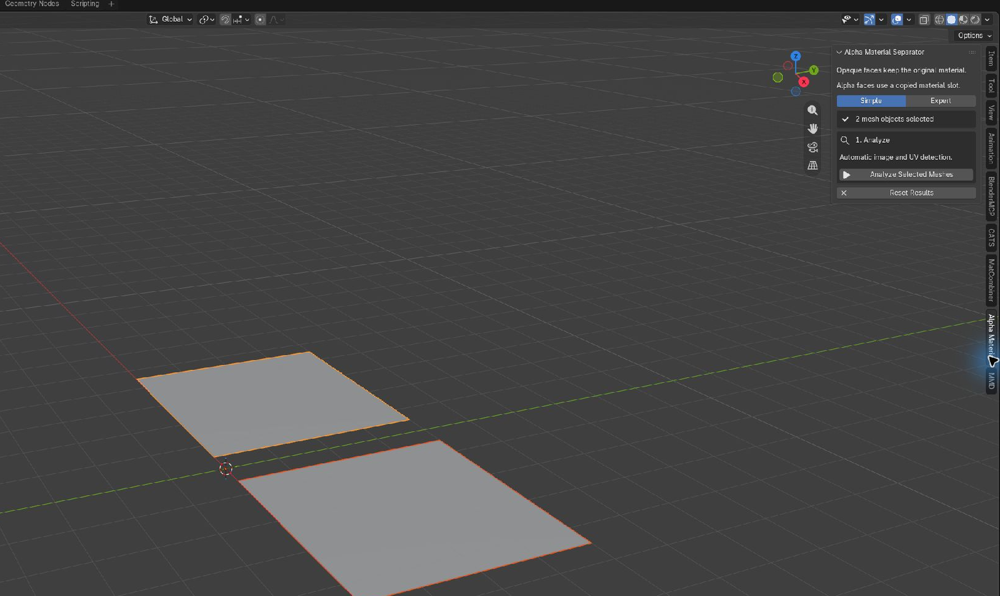

# Blender Alpha Material Separator

## What it does

Blender Alpha Material Separator finds mesh faces whose image pixels use alpha.
Opaque faces stay on the source material, while affected faces use a local
`__AMS_ALPHA` material copy.

The result is one object with separate opaque and alpha material sections. The
extension does not cut geometry, split objects, or rewrite shaders.

Version 1.0.0 targets Blender 5.2 LTS.

## Install

1. Download `alpha_material_separator-1.1.0.zip`. Do not unzip it.
2. In Blender 5.2, open **Edit → Preferences → Get Extensions**.
3. Open the upper-right menu, choose **Install from Disk**, and select the ZIP.
4. Confirm that **Blender Alpha Material Separator** is enabled.
5. Return to a 3D View, press `N`, and open the **AMS** tab.

Save your `.blend` before processing an important model. Assignment supports
Blender Undo, but a saved file is still the safest starting point.

## Quick start

1. Select the mesh objects to process. You may start in Object Mode or Mesh
   Edit Mode; **Analyze Selected Meshes** switches to Object Mode when needed.
2. Leave the panel on **Simple** and click **Analyze Selected Meshes**.
   **Material Details** is collapsed after every successful analysis. If the
   panel says materials may need an alpha source, click
   **Open Material Details** to review them.
3. Preview is recommended but optional. **Preview Faces to Move** changes face
   selection and enters multi-object Edit Mode so you can inspect the planned
   faces. Press `Tab` when finished.
   Changing selection or mode does not require another analysis.
4. Click **Apply Material Separation**. Apply without Preview always asks for confirmation.
   The dialog shows aggregate assignment outcomes; image, UV,
   material, and destination details remain under
   **Review → Material Details**.

Supported material groups are processed independently. A material that cannot
be resolved does not block safe work on another material.

## Understanding the results

| Result | Meaning | Default action |
| --- | --- | --- |
| **Stay on opaque material** | No covered pixel is below the alpha threshold. | Keep the face on the source material. |
| **Move to alpha material** | Every covered pixel is alpha-affected. | Move the face to `__AMS_ALPHA`. |
| **Mixed—must use alpha without cutting geometry** | One polygon covers opaque and alpha-affected pixels. | Move it to alpha because separating part of the polygon would require cutting geometry. |
| **Below significance—needs review** | Alpha evidence exists but is below an Expert minimum. | Keep the face on the source material and assign the rest of the group normally. |
| **Could not analyze** | The result or alpha source could not be proven. | Route resolved face-local uncertainty to alpha; leave an unresolved material unchanged. |

## When a material needs help

Automatic detection is the normal path. If a material reports
**No clear alpha image was found**, open **Material Details** and click
**Set Manual Alpha Source**. Blender switches to **Expert** and creates an
override for only that material; other materials remain automatic.

Each per-material override can set:

- **Image:** the image containing the intended alpha or mask.
- **Channel:** Alpha, Red, Green, Blue, or Luminance.
- **UV map:** the raw UV layer used by that image.
- **Addressing:** Automatic, Repeat, Extend, Clip, or Mirror.

UV coordinates may be below 0 or above 1 on either axis. The chosen addressing
mode determines which pixels they sample. For supported automatic patterns,
packed masks, baked procedural masks, and unsupported cases, see the
[material-support matrix](docs/material-support.md).

A material without a usable automatic or manual source reports
**Left unchanged — no alpha source selected** and stays completely unchanged.

## Safety, undo, and reruns

- **Analyze** reads selected base meshes, materials, UVs, and image pixels. It
  may leave Edit Mode but makes no persistent mesh or material changes.
- **Preview** changes selection only and normally enters multi-object Edit
  Mode. It does not change topology or material assignments.
- **Apply** creates or reuses local `__AMS_ALPHA` materials, adds planned
  material slots, and changes only planned polygon material assignments.

Source shaders, images, topology, UVs, normals, attributes, shape keys, vertex
groups, armatures, modifiers, parenting, and unselected objects are preserved.
Shared, linked, or read-only mesh data is skipped rather than changed
automatically.

Press `Ctrl+Z` to undo assignment. Repeated runs reuse valid derived materials
and slots; when nothing remains to move, the panel reports
**Already separated — no additional changes**.

If a classification input changes, the panel reports
**Inputs Changed — Analyze Again**. Selection or mode changes do not invalidate
equal inputs. Assignment-only plan changes require confirmation, not another analysis.
Apply performs a final synchronous check before changing data.

## After export

The source material is the opaque candidate and `__AMS_ALPHA` is the
alpha-capable candidate. Configure those material sections for the destination
renderer after export; copying a Blender material does not configure another
renderer automatically.

Separating opaque and alpha-affected faces can reduce transparent rendering
work, but the additional material section may add a draw call. Filtering,
compression, clipping, mipmaps, and shader behavior can also make the final
render differ from Blender's image-alpha preview.

## Troubleshooting

| Message or symptom | What to do |
| --- | --- |
| **No mesh objects selected** | Select one or more mesh objects and analyze again. |
| **No clear alpha image was found** | Use **Set Manual Alpha Source** for that material. |
| **Alpha uses unsupported shader processing** | Select the intended image and channel manually, or bake the final mask to an image. |
| **No active render UV map** | Set an active render UV or enter its exact name in Expert. |
| **Inputs Changed — Analyze Again** | A mesh, material, image, UV, or analysis setting changed; analyze again. |
| **Uncertain faces will use alpha** | Preview them if desired; Simple conservatively routes face-local uncertainty to alpha. |
| **Left unchanged — no alpha source selected** | Set a manual source only if that material also needs separation. |
| Mesh data is shared, linked, or read-only | Make a deliberate editable copy; the extension never does this automatically. |
| **Already separated — no additional changes** | The selected meshes need no further material moves. |
| Analysis is slow | Wait, press `Esc`, or use **Cancel Analysis**; cancellation keeps the previous completed report. |

## More documentation

- [Material support](docs/material-support.md)
- [Testing and contributing](docs/testing.md)
- [Integration API](docs/integration-api.md)
- [Performance](docs/performance.md)

## License

Blender Alpha Material Separator is licensed under `GPL-3.0-or-later`. The
canonical GNU GPL version 3 text is preserved in [LICENSE](LICENSE).
